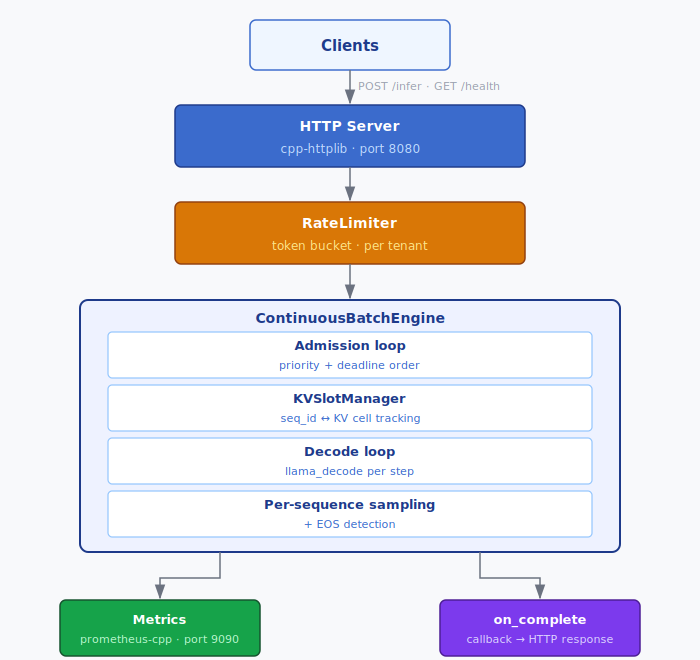

# Adaptive Multi-Tenant Inference Server

## Problem

Static batching wastes GPU time. When you run a batch of N sequences, short responses finish early but their KV cache slots stay reserved until the slowest sequence in the batch completes. Under variable response lengths — the normal case in production — GPU utilization drops significantly while you wait.

Continuous batching fixes this problem. The moment a sequence finishes, its KV cache slots are freed and the next waiting request is admitted immediately. The active set is a sliding window rather than a discrete batch, so the GPU stays utilized regardless of response length variance. This is the core innovation behind vLLM's original performance gains.

This project implements continuous batching from scratch in C++ against llama.cpp, with an OpenAI-compatible HTTP frontend, gRPC API, distributed rate limiting via Redis, per-tenant scheduling, and Kubernetes manifests for horizontal scale-out.

## Architecture



## How it works

The engine runs a single decode thread. On each iteration:

1. **Admit**: any free KV slots are filled from the waiting queue, highest priority / soonest deadline first.
2. **Decode**: one `llama_decode` call across all active sequences simultaneously.
3. **Sample**: one token is sampled per active sequence.
4. **Retire**: sequences that hit EOS, their `max_new_tokens` limit, or their deadline fire their callback and release their KV slots via `llama_kv_self_seq_rm`, making room for the next admission.

The KV cache is pre-allocated at startup (`n_ctx = max_slots × max_seq_len`). Each sequence is tagged with a `seq_id`; retiring a sequence untags its cells without touching any other sequence's state.

## Stack

| Concern | Library / Tool |
|---|---|
| HTTP server | [cpp-httplib](https://github.com/yhirose/cpp-httplib) |
| gRPC API | [gRPC C++](https://grpc.io) + [Protocol Buffers](https://protobuf.dev) |
| LLM inference | [llama.cpp](https://github.com/ggerganov/llama.cpp) |
| Distributed rate limiting | [Redis](https://redis.io) via [hiredis](https://github.com/redis/hiredis) |
| JSON | [nlohmann/json](https://github.com/nlohmann/json) |
| Metrics | [prometheus-cpp](https://github.com/jupp0r/prometheus-cpp) |
| Logging | [spdlog](https://github.com/gabime/spdlog) |
| Testing | [GoogleTest](https://github.com/google/googletest) |
| Observability | Prometheus + Grafana |
| Load testing | [wrk](https://github.com/wg/wrk) |
| Orchestration | Kubernetes (Deployment, HPA, Service) |

## Project Structure

```
.
├── include/          # Headers: request, engine, slot manager, metrics, rate limiter, server, gRPC server
├── src/              # Implementation + main.cpp
├── proto/            # inference.proto — InferenceService definition
├── tests/            # GoogleTest unit tests (server, rate limiter, KV slot manager)
├── bench/            # wrk load test scripts and results
├── docker/           # docker-compose for Prometheus + Grafana
├── k8s/              # Kubernetes manifests (Deployment, Service, HPA, Redis, ConfigMap)
└── CMakeLists.txt
```

## Building

### Local (macOS)

**Prerequisites:** CMake ≥ 3.20, C++20 compiler, Homebrew.

```bash
brew install nlohmann-json spdlog googletest prometheus-cpp hiredis grpc protobuf

cmake -B build
cmake --build build -j$(sysctl -n hw.ncpu)

ctest --test-dir build --output-on-failure

MODEL_PATH=/path/to/model.gguf REDIS_URL=redis://localhost:6379 ./build/inference_server
```

### Docker (full stack)

```bash
# Build image and start server + Redis + Prometheus + Grafana
MODEL_DIR=/path/to/dir/containing/model docker compose -f docker/docker-compose.yml up --build
```

The server expects the model at `$MODEL_DIR/model.gguf`. All four services start together; Prometheus scrapes the server automatically.

### Kubernetes

```bash
# 1. Build and push the image
docker build -t your-registry/inference-server:latest .
docker push your-registry/inference-server:latest

# 2. Load the model onto the PVC (one-time; e.g. via an init job or kubectl cp)
kubectl apply -f k8s/pvc.yaml

# 3. Deploy
kubectl apply -f k8s/redis.yaml
kubectl apply -f k8s/configmap.yaml
kubectl apply -f k8s/deployment.yaml
kubectl apply -f k8s/service.yaml
kubectl apply -f k8s/hpa.yaml
```

The HPA scales from 2 to 10 replicas at 70% CPU. All replicas share rate-limit state through Redis automatically.

## API

### OpenAI-compatible HTTP (port 8080)

**`POST /v1/chat/completions`**
```json
{
  "model": "local-model",
  "messages": [
    { "role": "system",  "content": "You are a helpful assistant." },
    { "role": "user",    "content": "Explain KV caching." }
  ],
  "max_tokens": 256
}
```
Pass the tenant API key as `Authorization: Bearer <key>` or `X-Tenant-ID: <key>`.

**`GET /v1/models`** — lists the loaded model.

**`GET /health`** — returns `{"status":"ok"}`, used by Kubernetes probes.

### Original endpoint

**`POST /infer`**
```json
{
  "tenant_id": "team-a",
  "payload": "your prompt",
  "priority": "high",
  "deadline_ms": 5000,
  "max_new_tokens": 128
}
```

### gRPC (port 50051)

Defined in `proto/inference.proto`:

```protobuf
service InferenceService {
  rpc Infer(InferRequest)           returns (InferResponse);
  rpc ChatComplete(ChatRequest)     returns (ChatResponse);
}
```

## Multi-node deployment

Rate limits are enforced via a Redis token-bucket Lua script, so all nodes share per-tenant quota automatically. When Redis is unavailable, each node falls back to its own in-memory bucket (fail-open).

```
[clients]
    │
  nginx / Envoy   ← least-connections load balancer
  /     │     \
Node1  Node2  Node3   ← each runs inference_server
              │
            Redis     ← shared rate limit state
```

Apply the Kubernetes manifests to deploy:

```bash
kubectl apply -f k8s/redis.yaml
kubectl apply -f k8s/configmap.yaml
kubectl apply -f k8s/deployment.yaml
kubectl apply -f k8s/service.yaml
kubectl apply -f k8s/hpa.yaml
```

The HPA scales from 2 to 10 replicas at 70% CPU utilization. To scale on KV-slot utilization instead, install the Prometheus adapter and point an `External` metric at `inference_kv_slot_utilization`.

## Observability

```bash
cd docker
docker compose up -d   # Prometheus :9090, Grafana :3000
```

Grafana default credentials: `admin` / `admin`. The Prometheus datasource and dashboard are provisioned automatically.

Key metrics:
- `inference_kv_slot_utilization` — fraction of KV slots in use; the primary signal for engine efficiency
- `inference_latency_seconds` — end-to-end request latency histogram
- `inference_queue_wait_seconds` — time spent waiting for a free slot
- `inference_batch_size` — active sequences per decode step
- `inference_requests_deadline_exceeded_total` — requests that expired before a slot was available
- `inference_requests_rate_limited_total` — requests rejected by the per-tenant token bucket

## Benchmarking

```bash
MODEL_PATH=/path/to/model.gguf ./build/inference_server &
./bench/run_bench.sh
```

The bench script mixes short and long prompts to produce variable response lengths — the workload where continuous batching's advantage is most pronounced.

### Results (SmolLM2-135M-Instruct-Q4_K_M, Apple Silicon, Metal/MPS)

**16 connections**

| Policy | Req/s | p50 | p99 |
|---|---|---|---|
| Continuous batch (adaptive) | **3.22** | 4826 ms | 5403 ms |
| Fixed batch | **3.22** | 4390 ms | 5386 ms |
| FIFO | 2.53 | 5151 ms | 5485 ms |

Continuous batching matches fixed-batch peak throughput while delivering ~27% more requests/sec than FIFO, with lower p99 latency under saturation.
